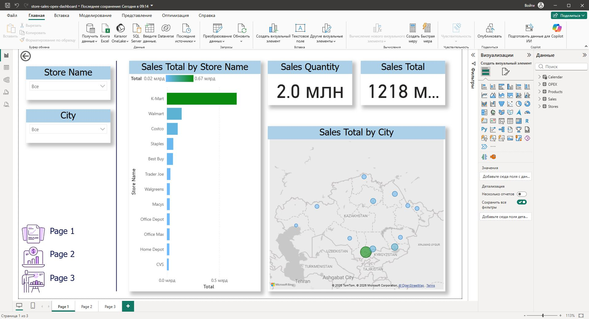
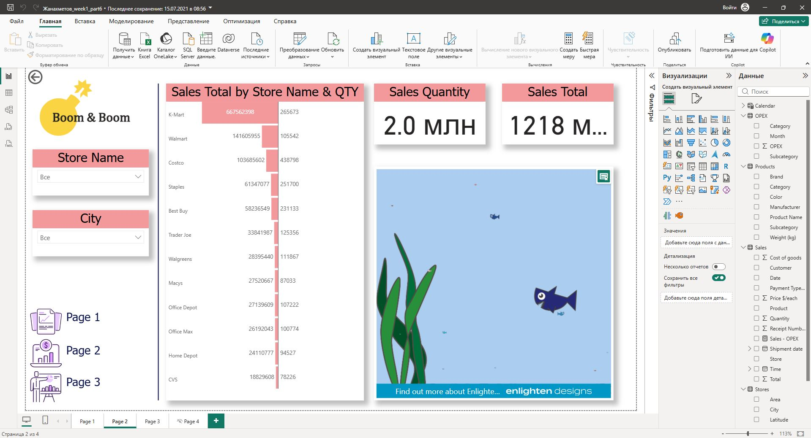
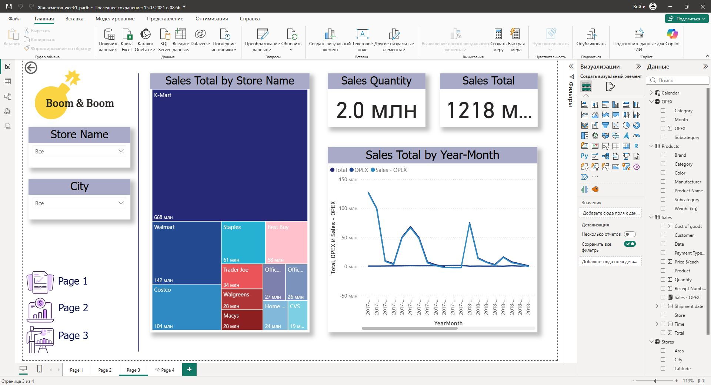

# Store Sales & OPEX Dashboard (Power BI)

Interactive Power BI dashboard for analyzing store sales performance, sales quantity, operating expenses, and business trends.

## Project Overview

This dashboard provides business insights across stores, cities, products, and time periods.  
It helps compare store performance, monitor sales and OPEX, and identify key business trends.

## Tools Used

- Power BI
- Power Query
- DAX
- Data Modeling
- Data Visualization

## Dashboard Features

- Sales total and sales quantity KPI cards
- Store performance analysis
- Sales by city map visualization
- Store ranking by total sales
- OPEX and sales trend analysis
- Treemap analysis by store
- Interactive filters by store and city

## Skills Demonstrated

- Power BI Dashboard Development
- KPI Reporting
- Business Intelligence Analysis
- Sales Performance Analysis
- OPEX Analysis
- Data Visualization
- Interactive Dashboard Design

## Dashboard Screenshots

## Files Included

- Power BI dashboard file (.pbix)
- Dashboard screenshots
- Project documentation
